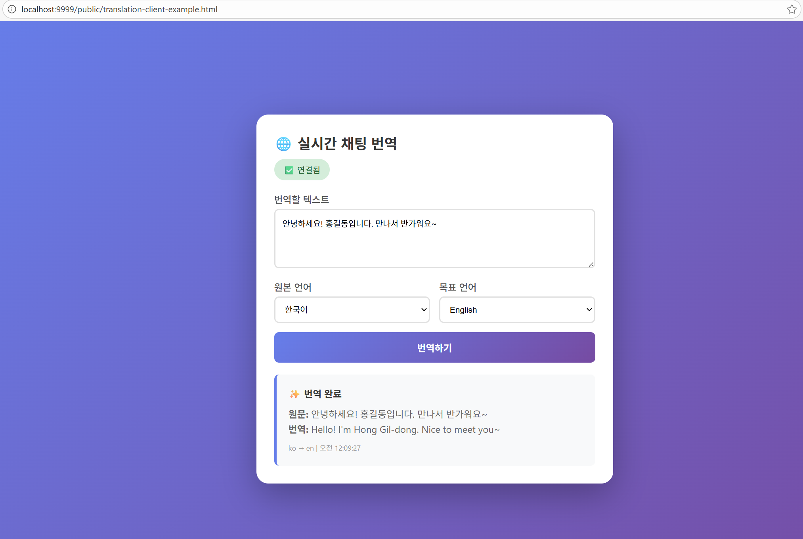

## NestJS Playground
NestJS 기능을 테스트하고 실험하기 위한 개인 프로젝트 공간

### 목적
- 구조 실험, 성능 테스트, 설정 검증 등 다양한 Poc(Proof of Concept)에 활용
- 테스트가 완료된 코드는 별도 브랜치로 이동 후, 내용 삭제

### 실험 원칙
- 이 저장소는 기능 검증 및 실험을 위한 공간
- 각 실험은 하나의 목적에만 집중
- 과도한 설계, 추상화, 최적화는 지양
- 검증이 완료된 코드는 별도 브랜치에 보관, main 브랜치는 초기화  

---

### 실시간 번역 사이트 (AI)
